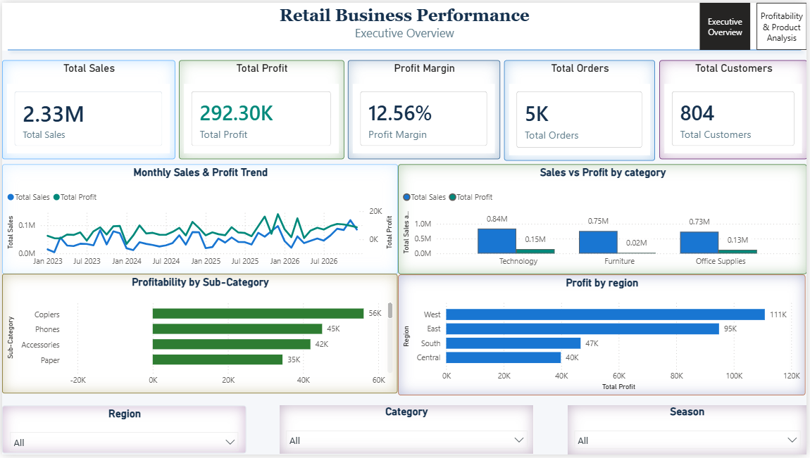
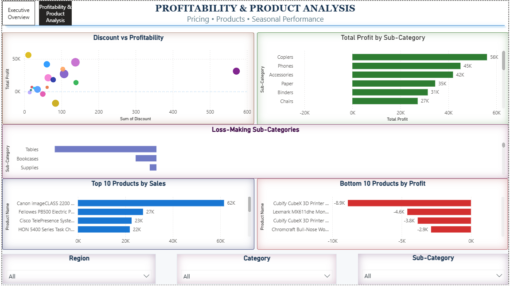

# 📊 Retail Business Performance Analysis Dashboard

## 📌 Project Overview

This project presents an end-to-end **Retail Business Performance Analysis Dashboard** built using **Power BI**. The objective was to transform raw retail sales data into actionable business insights that help stakeholders understand sales performance, profitability trends, regional performance, product effectiveness, and the impact of discounting on profit.

The dashboard enables decision-makers to monitor key business metrics, identify profit-draining products, evaluate seasonal trends, and make data-driven decisions to improve overall business performance.

---

## 🎯 Business Problem

Retail businesses often struggle to answer critical questions such as:

- Which product categories generate the highest revenue and profit?
- Which products or sub-categories are causing losses?
- How do discounts impact profitability?
- Which regions contribute the most to business profit?
- Are there seasonal trends affecting sales and profit?
- Which products should be promoted or discontinued?

Without a centralized reporting system, extracting these insights from raw transactional data is time-consuming and inefficient.

This project addresses these challenges through an interactive Power BI dashboard that provides a comprehensive view of business performance.

---

## 🛠️ My Contribution

### Data Preparation & Cleaning
- Imported raw retail sales data.
- Identified and resolved CSV formatting issues.
- Cleaned and standardized data using Python (Pandas).
- Removed inconsistencies and validated data quality.
- Loaded cleaned dataset into Power BI.

### Feature Engineering
Created additional business metrics including:

- Profit Margin (%)
- Shipping Days
- Seasonal Classification (Winter, Spring, Summer, Autumn)
- Total Orders
- Total Customers

### Data Modeling
- Created DAX measures for KPIs.
- Built calculated fields and business metrics.
- Designed interactive filtering and cross-filtering functionality.

### Dashboard Development
Designed and developed a multi-page Power BI dashboard including:

#### Executive Overview
- Total Sales
- Total Profit
- Profit Margin
- Total Orders
- Total Customers
- Monthly Sales & Profit Trend
- Sales vs Profit by Category
- Profitability by Sub-Category
- Profit by Region

#### Product & Profitability Analysis
- Top 10 Products by Sales
- Bottom 10 Products by Profit
- Discount vs Profitability Analysis
- Profit by Sub-Category Analysis

### Dashboard Styling
- Designed a professional executive-level dashboard layout.
- Implemented interactive slicers and page navigation.
- Applied conditional formatting for profit/loss visualization.
- Created a consistent color theme and KPI card design.

---

# 📈 Key Business Insights

## Overall Business Performance

| KPI | Value |
|------|--------|
| Total Sales | **$2.33M** |
| Total Profit | **$292.30K** |
| Profit Margin | **12.56%** |
| Total Orders | **5K+** |
| Total Customers | **804** |

---

## Category Performance

### Technology
- Highest sales among all categories.
- Highest profit contribution.
- Strongest performing category overall.

### Furniture
- Significant sales volume.
- Lower profitability compared to Technology.

### Office Supplies
- Sales comparable to Furniture.
- Moderate profit generation.

---

## Sub-Category Analysis

### Most Profitable Sub-Categories
- Copiers
- Phones
- Accessories
- Paper

### Loss-Making Sub-Categories
- Tables
- Bookcases
- Supplies

These products negatively impacted overall profitability despite generating sales.

---

## Regional Analysis

### Highest Profit Region
🏆 **West Region**

Generated the highest total profit among all regions.

### Lowest Profit Region
⚠️ **Central Region**

Contributed the least profit and may require operational improvements.

---

## Discount Impact Analysis

One of the most important findings from the analysis:

- Profitability decreases as discounts increase.
- The correlation between Discount and Profit was approximately:

**-0.0044**

While weak overall, detailed analysis showed that:

### Critical Threshold

⚠️ Profit begins turning negative around **30% discount (0.30)**.

This indicates that aggressive discounting can significantly erode margins and lead to losses.

---

## Seasonal Analysis

### Highest Sales Season
🍂 **Autumn**

Generated the highest sales performance.

### Highest Profit Season
🍂 **Autumn**

Also produced the highest profit contribution.

### Lowest Performing Season
☀️ **Summer**

Recorded comparatively lower profitability.

---

# 📊 Dashboard Pages

## Page 1 – Executive Overview

Provides a high-level summary of business performance.

### Visuals Included
- KPI Cards
- Monthly Sales & Profit Trend
- Sales vs Profit by Category
- Profitability by Sub-Category
- Profit by Region
- Interactive Filters

---

## Page 2 – Product & Profitability Analysis

Provides deeper product-level insights.

### Visuals Included
- Top 10 Products by Sales
- Bottom 10 Products by Profit
- Discount vs Profitability Scatter Plot
- Profit by Sub-Category
- Interactive Filters

---

# 🚀 Business Impact

The dashboard helps management:

✅ Identify high-performing categories and products

✅ Detect loss-making products requiring intervention

✅ Monitor regional performance

✅ Optimize discount strategies

✅ Improve profit margins

✅ Support inventory and pricing decisions

✅ Enable faster and data-driven decision-making

---

# 🧰 Tools & Technologies Used

- **Power BI**
- **Power Query**
- **DAX**
- **Python**
- **Pandas**
- **CSV Data Processing**
- **Data Visualization**

---

# 📷 Dashboard Preview

### Executive Overview

### Product & Profitability Analysis

---

# 📚 Learning Outcomes

Through this project, I gained hands-on experience in:

- Data Cleaning and Preparation
- Power Query Transformations
- DAX Measure Creation
- Data Modeling
- Business Intelligence Reporting
- Dashboard Design Principles
- Interactive Data Visualization
- Business Insight Generation

---

## 👨‍💻 Author

**Sonal Shelke**

Data Analyst | Power BI | SQL | Python | Data Visualization

---

⭐ If you found this project interesting, consider giving the repository a star.
